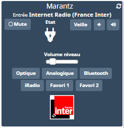

Plugin Marantz Denon (marantzdenon)
=============================


Plugin pour commander les ampli de marque Marantz et Denon via Jeedom.

> **Note**  
> Ce plugin se base sur le plugin officiel (denonavr) mais ajoute quelques fonctionnalités et la compatibilité avec les amplis plus récents.


**Fonctionnalités :**

- Allumer / éteindre,
- Changer d'entrée,
- Contrôler le volume (en absolu ou relatif) et activer/désactiver mute,
- Veille programmable (sleep),
- Retour d'état sur les principales fonctionnalités,
- Accès aux favoris,
- Afficher le logo du contenu en train d'être diffusé (radio),
- Gestion de 3 zones (principale + zone 2 & 3),
- Possibilité d'ajouter des commandes personnalisées (en séquence).


**Modèle compatibles**
- Marantz M-CR511 & Marantz M-CR611
- Marantz NR1606 ou similaire
- Denon AVR X2000/3000/4000
- Denon CEOL N4/9 (à confirmer)
- Probablement d'autres modèles Denon/Marantz


> **Note**    
> Le retour du volume n'a pas l'air de fonctionner sur tous les modèles (bug firmware)

Dashboard
=======================




Configuration du plugin
=======================

Après téléchargement du plugin, activer le plugin.

Configuration des équipements
=============================

La configuration des équipements Marantz/Denon est accessible à partir du menu *Plugins > Multimedia > Marantz Denon*.

Vérifier que l'ampli est bien branché, visible sur le réseau et que vous connaissez l'IP avant d'ajouter un équipement (vous pouvez vérifier facilement en testant que la page http://MonIP/goform/formMainZone_MainZoneXml.xml renvoie quelque chose).

#### Onglet Equipement:

-   **Nom de l’équipement Denon** : nom de votre équipement,
-   **Objet parent** : indique l’objet parent auquel appartient
    l’équipement,
-   **Catégorie** : les catégories de l’équipement (il peut appartenir à
    plusieurs catégories),
-   **Activer** : permet de rendre votre équipement actif,
-   **Visible** : rend votre équipement visible sur le dashboard,
-   **IP** : IP de l’ampli. L'ajout du port 8080 (IP:8080) est parfois nécessaire.
-   **Info Modèle** : La référence du modèle retourné par l'équipement our information (non modifiable),
-   **Type de Modèle** : création des commandes en fonction de ce choix,
-   **Zone** : zone à contrôler (principale ou zone 2/3),
-   **Nombre de favoris** : commandes d'accès aux favoris à créer (max 4),
-   **Volume Maximum** : volume maximum qu'il est possible de commander via le plugin (0-98),
-   **Volume par défaut** : volume par défaut lors de l'allumage via le plugin (0 pour désactiver),
-   **Durée Veille par défaut** : création d'un bouton d'activation de veille programmée avec une durée par défaut. 0-120 en minutes (0 pour ne pas créer de bouton),
-   **Pas volume +/-** : le pas pour la commande de volume relatif (+/-). Entre 1 et 10 (défaut = 1),
-   **Peut être éteint** : ne génère pas d'erreurs si l'équipement est débranché.

> **Notes**
>
> Pour certain modèles, il est nécessaire d'ajouter *:8080* à l'IP dans le champ correspondant (eg: 192.168.0.120:8080).   
> Cela concerne des modèles récents (après 2016) notamment ceux compatibles HEOS.


#### Onglet Commandes

Les commandes de bases sont générées automatiquement en fonction du modèle de
votre amplificateur. Si le modèle n'est pas connu il prendra une configuration la plus étendue.
Il est possible de les renommer, tester et configurer les paramêtres d'apparence.

Vous pouvez également ajouter de nouvelles commandes (voir section ci-dessous).


Liste des commandes non visibles par défaut :
- *Accessible* : info binaire qui donne l'état de disponibilité de l'amli par le plugin (si débranché ou IP non accessible) ;
- *IP* : l'IP de l'ampli (pour utilisation via scénario) ;
- *Audio* : mode surround selectionné (ne fonctionne que sur certain modèles) ;
- *Input* : nom alternatif du nom de l'entrée (tel que renvoyé par l'ampli). A utiliser pour les scénario ;
- *Playing* : nom de la radio selectionnée (ne fonctionne que sur certain modèles) ;
- *Sleep* :slider d'activation du mode veille programmé (durée en minute) ;
- *Logo* : affiche une image miniature de ce qui est actuellement diffusé. Disponible que pour les entrées de type NET tel que iRadio, Media Server... (ne fonctionne que sur certain modèles) ;

Pour les voir sur le dashboard, il faut activer 'Afficher' dans l'onglet des commandes.

> **Notes**
>
> - La commande de volume se fait sur des valeurs entre 0 et 98 et non pas sur des valeurs en db.


Commandes personnalisées
=============================

#### Commandes simples

- Ajouter un bouton de selection de volume fixe :   
Créer un nouvelle commande avec pour valeur *volume_set_XX* avec XX pour volume (ex: volume_set_35, volume_set_07)
- Ajouter une entrée inexistante pour le modèle choisi :   
Créer un nouvelle commande avec pour valeur *si_XXXXX* avec XXXXX comme nom de l'entrée (ex: si_SPOTIFY).

#### Séquence & commandes sécifiques à l'ampli

Il est possible d'ajouter des commandes avancées spécifique à l'ampli. La spécification en contient beaucoup et est disponible <a target="_blank" href="../assets/AVRX4000_PROTOCOL(10_3_0)_V03.pdf">ici</a> ou <a target="_blank" href="https://usa.denon.com/us/product/hometheater/receivers/avrx4000?docname=AVRX4000_PROTOCOL(10%203%200)_V03.pdf">là</a>.

Extrait du document :


> **Notes**
>
> Toutes les commandes de la documentation ne sont peut être pas disponible pour votre modèle.

Pour cela la nouvelle commande action créée devra avoir comme valeur ce qui se trouve dans le tableau des commandes disponibles de la doc (a partir de la page 8).

Il est également possible de créer des séquences en séparant les commandes par ',' (une valeur numérique marque une pause en secondes).

Exemples :

- *Z207* : Volume de la zone 2 au niveau 7.

- *PWON,3,mute_on,4,MV04,SIIRADIO* : allumer l'ampli, attendre 3 secondes, mute, attendre 4 secondes, volume à 4, mettre la Radio

- *SIIRADIO,3,SLEEP060* : mettre la Radio, attendre 3 secondes, mise en veille dans 1 heure.


> **Notes**
>
> En plus de la spécification, les commandes suivantes sont disonibles :
>
>   on, off, sleepbtn (simule bouton veille), fav_x (favori numéro x),   
>   volume_up, volume_down, mute_on, mute_off,   
>   cur_left, cur_right, cur_down, cur_up (simule la navigation sur écran)    
>  (*on,8,mute_on,SIIRADIO,Z2DIGITALIN1,Z3BT,2,mute_off,Z207,Z310*)


FAQ
=============================

###### Aucune commande ne semble fonctionner

- Vérifier que l'ampli est disponible sur le réseau (par ping),
- Tester que les liens suivant fonctionnent (en mettant la bonne IP) http://MonIP/goform/formMainZone_MainZoneXml.xml (renvoie une page xml), http://MonIP/goform/formiPhoneAppDirect.xml?PWON (allume l'ampli),
- Si ne fonctionne pas, essayer avec les mêmes url mais sur le port 8080 (http://MonIP:8080/goform/formMainZone_MainZoneXml.xml). Si ok, modifier le champ du plugin avec *IP:8080* au lieu de *IP*.

###### Récupérer l'image de la lecture en cours (selon modèles)

```
 http://{IP-Ampli}/NetAudio/art.asp-jpg
```

###### Autres pages web disponibles (selon modèles)

```
http://{IP-Ampli}/goform/formMainZone_MainZoneXml.xml
http://{IP-Ampli}/goform/formMainZone_MainZoneXml.xml?ZoneName=ZONE2
http://{IP-Ampli}/goform/formMainZone_MainZoneXmlStatus.xml
http://{IP-Ampli}/goform/formMainZone_MainZoneXmlStatusLite.xml
http://{IP-Ampli}/goform/formZone2_Zone2XmlStatus.xml
http://{IP-Ampli}/goform/formZone2_Zone2XmlStatusLite.xml
http://{IP-Ampli}/goform/formNetAudio_StatusXml.xml
http://{IP-Ampli}/goform/formNetAudio_StatusXml.xml?ZoneName=MAIN+ZONE
http://{IP-Ampli}/goform/formNetAudio_StatusXml.xml?ZoneName=ZONE2
http://{IP-Ampli}/goform/Deviceinfo.xml
```

Changelog
=============================

[Voir la page dédiée](changelog.md).
