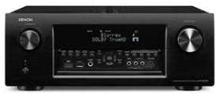
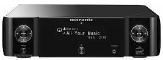
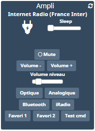
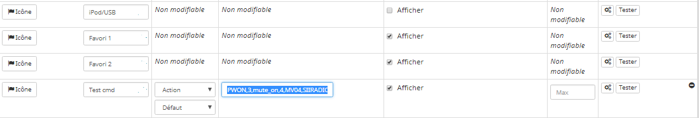
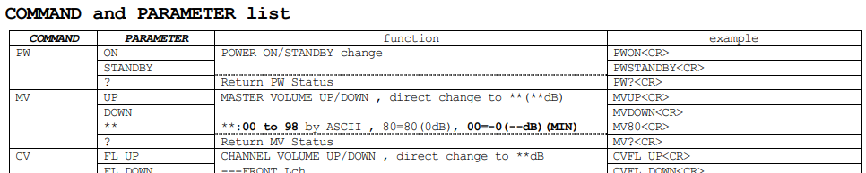

Description du plugin 
=============================

Plugin pour commander les amplificateurs Marantz ou Denon récents. Il s'agit d'une reprise du plugin denonavr mais mis à jour pour les amplis plus récents.

Vous pourrez contrôler les entrées à utiliser, sortie de veille, mettre en veille
l’amplificateur et contrôler le volume, activer le mode sleep. 
Vous avez aussi un retour d’état
indiquant si la zone est active, le niveau de volume, l’entrée
selectionnée et le type audio.




**Modèle compatibles**
- Marantz M-CR511 & Marantz M-CR611

- Denon AVR X 3000/4000 (non testé)

- Très probablement Denon CEOL Nx

- Probablement d'autres modèles Denon/Marantz (ex: CEOL Nx)


Pour les amplis plus anciens, le plugin original denonavr fonctionne toujours.


> **Note**
>
> Le retour du volume n'a pas l'air de fonctionner sur tous les modèles (bug firmware)

Dashboard
=======================



Configuration du plugin 
=======================

Après téléchargement du plugin, activer le plugin.

Configuration des équipements 
=============================

La configuration des équipements Marantz/Denon récents est accessible à partir du menu
Plugins puis multimedia.

### Onglet Equipement:

-   **Nom de l’équipement Denon** : nom de votre équipement,

-   **Objet parent** : indique l’objet parent auquel appartient
    l’équipement,

-   **Catégorie** : les catégories de l’équipement (il peut appartenir à
    plusieurs catégories),

-   **Activer** : permet de rendre votre équipement actif,

-   **Visible** : rend votre équipement visible sur le dashboard,

-   **IP** : IP de l’amplificateur,

-   **Info Modèle** : La référence du modèle retourné par l'équipement (non modifiable),

-   **Type de Modèle** : Créer les commandes en fonction de ce choix,

-   **Zone** : zone à contrôler (principale ou zone 2/3),

-   **Nombre de favoris** : commandes de favoris a créer,

-   **Volume Maximum** : Volume maximum qu'il est possible de commander via le plugin,

-   **Volume par défaut** : Volume par défaut lors de l'allumage via le plugin,

-   **Peut être éteint** : Ne génère pas d'erreurs si l'équipement est débranché.


### Onglet Commandes

Les commandes de bases sont générées automatiquement en fonction du modèle de
votre amplificateur. Si le modèle n'est pas connu il prendra une configuration la plus étendue.
Il est possible de les renommer, tester et configurer les paramêtres d'apparence.

Vous pouvez également ajouter de nouvelles commandes.




Commandes personalisées 
=============================

Il est possible d'ajouter des commandes personalisées. La spécification en contient beaucoup et est disponible <a target="_blank" href="../assets/AVRX4000_PROTOCOL(10_3_0)_V03.pdf">en local</a> ou <a target="_blank" href="https://usa.denon.com/us/product/hometheater/receivers/avrx4000?docname=AVRX4000_PROTOCOL(10%203%200)_V03.pdf">en ligne</a>.



Pour cela la commande action devra avoir comme valeur ce qui se trouve dans le tableau des commandes disponibles de la doc.

Il est également possible de créer des séquences en séparant les commandes par ',' (une valeur numérique marque une pause en seconde).

Exemples 
```
- **Z207** : Volume de la zone 2 au niveau 7.

- **PWON,3,mute_on,4,MV04,SIIRADIO** : Allumer, attendre 3 secondes, mute, attendre 4 secondes, Volume à 4, mettre la Radio

- **SIIRADIO,3,SLEEP060** : Mettre la Radio, attendre 3 secondes, Veille dans 1 heure.
```


